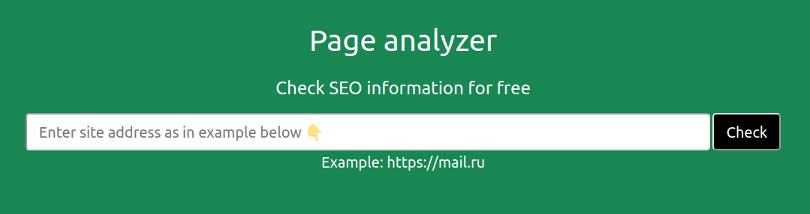

### Simple page analyser  
This is a web service that can give you some basic information of the web site you are interested in, namely:
- **Response** code when you load the main page
- page **Title**
- page **h1**
- page **Description**
### It works as simple as one-two-three:
1. Enter the address of the web site you want to check and hit enter. If the address is correct you'll be redirected to the page with the addresses added before including this one.
2. Choose the address whose data you want to analyse and click on it. You'll be redirected to the check-page.
3. Press **One more check** button to get the data. If the web site has this data you'll see _Response_ code, _Title_, _h1_ and _Description_.

Also the timestamps of the actions produced over the addresses are added to the info data. 

### To see the site click on the picture ⤵

